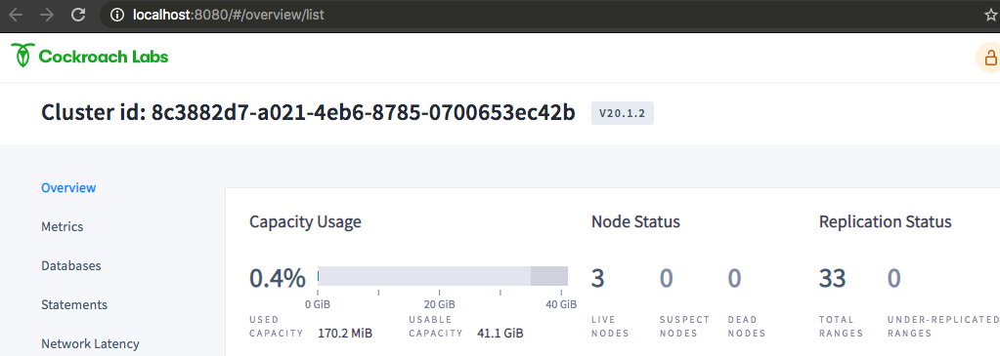
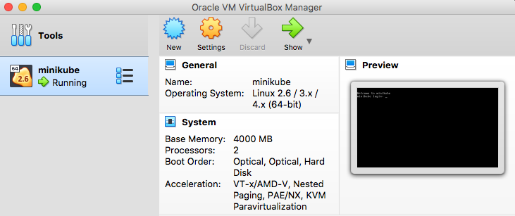

= CockroachDB Demo on Minikube
This repository contains instructions for deploying Cockroach with Kuberntes usiung Minikube. Portions of this tutorial are from the official link:https://www.cockroachlabs.com/docs/stable/[CockroachDB] documention, yet are abbreviated and noted were applicable, however this repository includes extras such as setting up HJAproxy on your local machine, etc.

After working through this lab you will have a highly-available triple-node CockroachDB cluster running within Minukube and fronted by Haproxy  on your local machine.  Included with this lab are instructions for DB/performance tests, monitoring, and a Python Lab to get your started. 

== Assumptions
. This lab is intended to jumpstart your learning and allow you the freedom to explore CockroachDB with minimal effort in your local (home) dev environment.  Please consult the official documentation for getting a production grade set of clusters running. Note that instead of creating a 'tools' VM, this lab is installing software on your local machine.  Also this lab makes use of installing binaries when possible as a matter of personal taste.

== Requirements
* link:https://www.cockroachlabs.com/docs/stable/install-cockroachdb-mac.html#download-the-binary-1/[CockroachDB]
* link:https://www.virtualbox.org/[Virtualbox]
* link:http://https://kubernetes.io/docs/tasks/tools/install-kubectl/[Kubectl]
* link:https://kubernetes.io/docs/tasks/tools/install-minikube/[Minikube]
* link:https://https://formulae.brew.sh/formula/haproxy/[HAproxy]
* link:https://pypi.org/project/psycopg2/[psycopg2]

== Setup kubectl
. Download and Install kubectl
+
----
$ curl -LO "https://storage.googleapis.com/kubernetes-release/release/$(curl -s https://storage.googleapis.com/kubernetes-release/release/stable.txt)/bin/darwin/amd64/kubectl"
$ chmod +x ./kubectl
$ sudo mv ./kubectl /usr/local/bin/kubectl
----
. Check for successful installation
+
----
$ kubectl version --client
    Client Version: version.Info { 
    Major:"1",
    Minor:"18",
    GitVersion:"v1.18.4",
    GitCommit:"c96aede7b5205121079932896c4ad89bb93260af",
    GitTreeState:"clean",
    BuildDate:"2020-06-17T11:41:22Z",
    GoVersion:"go1.13.9",
    Compiler:"gc", 
    Platform:"darwin/amd64"
    }
----

== Setup Minikube
. Make sure link:https://www.virtualbox.org/[Virtualbox] is already installed on your machine.
. Install Minikube
+
----
$ curl -Lo minikube https://storage.googleapis.com/minikube/releases/latest/minikube-darwin-amd64 && chmod +x minikube
$ sudo mv minikube /usr/local/bin
----
. Start Minikube
+
----
$ minikube start
😄  minikube v1.11.0 on Darwin 10.13.6
🌟  Using the virtualbox driver based on existing profile
👍  Starting control plane node minikube in cluster minikube
🔄  Restarting existing virtualbox VM for "minikube" ...
🐳  Preparing Kubernetes v1.18.3 on Docker 19.03.8 ...
🔎  Verifying Kubernetes components...
🌟  Enabled addons: default-storageclass, ingress, storage-provisioner
🏄  Done! kubectl is now configured to use "minikube"
----

