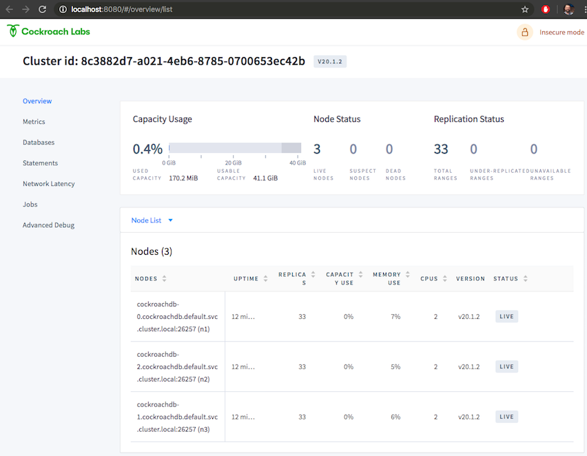

= CockroachDB on Minikube

== Navigation

* link:https://github.com/bbertka/cockroachdb-minikube#part-1---setting-up-the-environment[Environment Setup]
* link:https://github.com/bbertka/cockroachdb-minikube#part-2---configuring-haproxy-for-cockroachdb-on-minukube[Configuring HAproxy for CRDB on Minukbe]
* link:https://github.com/bbertka/cockroachdb-minikube#part-3---cockroachdb-workload-monitoring--performance[Workload Monitoriung & Performance]
* link:https://github.com/bbertka/cockroachdb-minikube#part-4---cockroachdb-high-availability[High Availability]
* link:https://github.com/bbertka/cockroachdb-minikube#part-5---python-code-example[Python Code Example]
* link:https://github.com/bbertka/cockroachdb-minikube#analysis[Analysis of Findings]
* link:https://github.com/bbertka/cockroachdb-minikube#future[Future Work]

== About
This repository contains my experience of deploying CockroachDB with Kuberntes using Minikube, in a repeatable tutorial/workshop format.  Portions of this tutorial are from the official link:https://www.cockroachlabs.com/docs/stable/[CockroachDB] documention, yet are abbreviated and noted were applicable, however this repository includes extras such as setting up HAproxy on your local machine, etc.

image:images/repo1-main-dashboard.png[]

After working through this lab you will have a highly-available triple-node CockroachDB cluster running within Minukube and fronted by Haproxy  on your local machine.  Included with this lab are instructions for DB/performance tests, monitoring, and a Python Lab to get your started. 

At the end of this write-up, I have some analysis to share of my personal experience.  Yours may be different depending on a variaty of factors.

== Assumptions
. This lab is intended to jumpstart your learning and allow you the freedom to explore CockroachDB with minimal effort in your local (home) dev environment.  Please consult the official documentation for getting a production grade set of clusters running. Note that instead of creating a 'tools' VM, this lab is installing software on your local machine.  Also this lab makes use of installing binaries when possible as a matter of personal taste.

[#environment-setup]
= Part 1 - Setting up the Environment

== Requirements
* link:https://www.cockroachlabs.com/docs/stable/install-cockroachdb-mac.html#download-the-binary-1/[CockroachDB]
* link:https://www.virtualbox.org/[Virtualbox]
* link:http://https://kubernetes.io/docs/tasks/tools/install-kubectl/[Kubectl]
* link:https://kubernetes.io/docs/tasks/tools/install-minikube/[Minikube]
* link:https://https://formulae.brew.sh/formula/haproxy/[HAproxy]
* link:https://pypi.org/project/psycopg2/[psycopg2]

== Setup kubectl
. Download and Install kubectl
+
----
$ curl -LO "https://storage.googleapis.com/kubernetes-release/release/$(curl -s https://storage.googleapis.com/kubernetes-release/release/stable.txt)/bin/darwin/amd64/kubectl"
$ chmod +x ./kubectl
$ sudo mv ./kubectl /usr/local/bin/kubectl
----
. Check for successful installation
+
----
$ kubectl version --client
    Client Version: version.Info { 
    Major:"1",
    Minor:"18",
    GitVersion:"v1.18.4",
    GitCommit:"c96aede7b5205121079932896c4ad89bb93260af",
    GitTreeState:"clean",
    BuildDate:"2020-06-17T11:41:22Z",
    GoVersion:"go1.13.9",
    Compiler:"gc", 
    Platform:"darwin/amd64"
    }
----

== Setup Minikube within Virtualbox
. Make sure link:https://www.virtualbox.org/[Virtualbox] is already installed on your machine.
. Install Minikube
+
----
$ curl -Lo minikube https://storage.googleapis.com/minikube/releases/latest/minikube-darwin-amd64 && chmod +x minikube
$ sudo mv minikube /usr/local/bin
----
. Start Minikube
+
----
$ minikube start
😄  minikube v1.11.0 on Darwin 10.13.6
🌟  Using the virtualbox driver based on existing profile
👍  Starting control plane node minikube in cluster minikube
🔄  Restarting existing virtualbox VM for "minikube" ...
🐳  Preparing Kubernetes v1.18.3 on Docker 19.03.8 ...
🔎  Verifying Kubernetes components...
🌟  Enabled addons: default-storageclass, ingress, storage-provisioner
🏄  Done! kubectl is now configured to use "minikube"
----

== Install CockroachDB 
For simplicity sake, let's start CockroachDB via a standard Kubernetes Config YAML rather than leveraging link:https://helm.sh/[Helm].  We will want to be familiar with what is being deployed, and can inspect the config YAML stateful set. It's is assumed the user may not already be using Helm or new to Kubernetes.

. First lets download and check out what we plan to deploy
+
----
$ curl -O https://raw.githubusercontent.com/cockroachdb/cockroach/master/cloud/kubernetes/cockroachdb-statefulset.yaml
  % Total    % Received % Xferd  Average Speed   Time    Time     Time  Current
                                 Dload  Upload   Total   Spent    Left  Speed
100  8149  100  8149    0     0  17792      0 --:--:-- --:--:-- --:--:-- 17792
...
----

. Open the stateful set and note we will be deploying three replica CockroachDB nodes
+
----
$ cat cockroachdb-statefulset.yaml 
...
apiVersion: apps/v1
kind: StatefulSet
metadata:
  name: cockroachdb
spec:
  serviceName: "cockroachdb"
  replicas: 3
  selector:
    matchLabels:
      app: cockroachdb
  template:
    metadata:
      labels:
        app: cockroachdb
...
----

. Deploy the database as a cluster within Minukube
+
----
$ kubectl create -f https://raw.githubusercontent.com/cockroachdb/cockroach/master/cloud/kubernetes/cockroachdb-statefulset.yaml
$ kubectl create -f https://raw.githubusercontent.com/cockroachdb/cockroach/master/cloud/kubernetes/cluster-init.yaml
----

. View the newly created resources.  We have three pods and some services to allow communication. 
+
----
$ kubectl get all

NAME                READY   STATUS    RESTARTS   AGE
pod/cockroachdb-0   1/1     Running   1          1h
pod/cockroachdb-1   1/1     Running   1          1h
pod/cockroachdb-2   1/1     Running   1          1h

NAME                         TYPE           CLUSTER-IP       EXTERNAL-IP   PORT(S)                          AGE
service/cockroachdb          ClusterIP      None             <none>        26257/TCP,8080/TCP               1h
service/cockroachdb-public   ClusterIP      10.106.48.55     <none>        26257/TCP,8080/TCP               1h
service/kubernetes           ClusterIP      10.96.0.1        <none>        443/TCP                          1h

NAME                           READY   AGE
statefulset.apps/cockroachdb   3/3     1h

NAME                     COMPLETIONS   DURATION   AGE
job.batch/cluster-init   0/1           26h        1h
----

== View the CockroachDB Dashboard
What fun would administering a highly available and elastic system without a sweet dashboard?  Lets view the cockroach dashboard and get a feel for what kind of monitoring capabilities we have. However, because Cockroach is running within a virtualized environment on our machine, we need to enable local network access in order to view via a web browser. A feature of CockroachhDB is that Any node in the cluster can be leveraged to access the Console. 

. Set up a local port forward to port 8080 within the kubernetes cluster to the '0' node
+
----
$ kubectl port-forward cockroachdb-0 8080
Forwarding from 127.0.0.1:8080 -> 8080
Forwarding from [::1]:8080 -> 8080
----

. Access the Console from your Chrome browser (preferred): link:http://localhost:8080[http://localhost:8080]

== Creating your first Database
Now that we have a fully operational CockroachDB cluster on our system, lets load up our first DB.  We will be leveraging an included packaged SQL client from within the official CockroachDB docker image, allowing it to be temporary as we load items into a fresh schema.

. Fire up a CockroachDB SQL client from within your Kubernetes cluster
+
----
kubectl run cockroachdb -it --image=cockroachdb/cockroach:v20.1.2 --rm --restart=Never -- sql --insecure --host=cockroachdb-public
If you don't see a command prompt, try pressing enter.

root@cockroachdb-public:26257/defaultdb> 
----
. Now let's create the database 'bank' and add some initial tables and entries
+
----
root@cockroachdb-public:26257/defaultdb> CREATE DATABASE bank;
CREATE DATABASE

Time: 87.37572ms
----
+
----
root@cockroachdb-public:26257/defaultdb> CREATE TABLE bank.accounts (
    id UUID PRIMARY KEY DEFAULT gen_random_uuid(),
      balance DECIMAL
  );
CREATE TABLE

Time: 69.467532ms
----
+
----
root@cockroachdb-public:26257/defaultdb> INSERT INTO bank.accounts (balance)
  VALUES
      (1000.50), (20000), (380), (500), (55000);
INSERT 5

Time: 40.176844ms
----
. Let's confirm this data exists and ready for use
+
----
root@cockroachdb-public:26257/defaultdb> SELECT * FROM bank.accounts;
                   id                  | balance
---------------------------------------+----------
  19cb2405-0346-4796-99e0-cd40f35b565d |     380
  2a5d7a25-8669-4073-9a57-9a3168ea3fc0 |   55000
  49450989-d5d9-457b-86ea-e31c492c81f9 |     500
  ac1c0c21-f12f-4557-95e5-84041278a651 | 1000.50
  f79eeab7-ac6a-4c23-8ac3-4223a808b1d0 |   20000
(5 rows)

Time: 75.7201ms
----
. We are finished with DB creation and can now quit the shell and destroy the temp container
+
----
root@cockroachdb-public:26257/defaultdb> \q
pod "cockroachdb" deleted
----

== Congratulations!
You have successfully set up CockroachDB on your system with Kubernetes!

[#configure-haproxy]
= Part 2 - Configuring HAproxy for CockroachDB on Minukube

Before we can effectively test the behaviour and performance of an HA CockroachDB cluster under various circumstances including failing nodes, and workloads in our home lab, it is necessary for us to set up and configure a proxy to the cluster residing in the Minikube environment. We will first set up HAproxy to get our system wired up for communicating from our local workstation into the Minukube cluster. 

CockroachDB ships with come goodness that makes working with HAproxy easier.  Included is an HAproxy config file generator which we can leverage to more easily build a config which allows us to loadbalance into our cluster.

== Install CockroachDB locally
. Download the CockroachDB bits and move to a user accessible location
+
----
$ curl https://binaries.cockroachdb.com/cockroach-v20.1.2.darwin-10.9-amd64.tgz | tar -xJ
  % Total    % Received % Xferd  Average Speed   Time    Time     Time  Current
                                 Dload  Upload   Total   Spent    Left  Speed
100 40.3M  100 40.3M    0     0  10.6M      0  0:00:03  0:00:03 --:--:-- 10.6M
----
+
----
$ sudo cp -i cockroach-v20.1.2.darwin-10.9-amd64/cockroach /usr/local/bin/
----
+
----
$ which cockroach
/usr/local/bin/cockroach
----

== Generate an HAproxy config via CockroachDB's generator

. Open the necessary ports for accessing the cluster's ingress service on port 26257
+
----
$ kubectl port-forward service/cockroachdb-public 26257
Forwarding from 127.0.0.1:26257 -> 26257
Forwarding from [::1]:26257 -> 26257
----
. In a second shell session with the port forwarding currently running, leverage the CockroachDB HAProxy config generator specifying your localhost:26257 address on the port. A file called haproxy.cfg will be created in the directory this tool is run.
+
----
$ cockroach gen haproxy --insecure --host=127.0.0.1 --port=26257
----
+
. View the newly created HAproxy config file.  Notice the default host names created for us. We will need to configure our system to understand these mappings later.  At this point you can close your port-forward session.
+
----
$ cat haproxy.cfg 

global
  maxconn 4096

defaults
    mode                tcp
    # Timeout values should be configured for your specific use.
    # See: https://cbonte.github.io/haproxy-dconv/1.8/configuration.html#4-timeout%20connect
    timeout connect     10s
    timeout client      1m
    timeout server      1m
    # TCP keep-alive on client side. Server already enables them.
    option              clitcpka

listen psql
    bind :26257
    mode tcp
    balance roundrobin
    option httpchk GET /health?ready=1
    server cockroach1 cockroachdb-0.cockroachdb.default.svc.cluster.local:26257 check port 8080
    server cockroach2 cockroachdb-2.cockroachdb.default.svc.cluster.local:26257 check port 8080
    server cockroach3 cockroachdb-1.cockroachdb.default.svc.cluster.local:26257 check port 8080
----

== Run HAproxy with the CockroachDb HAproxy Config file

Did I mention this isnt an HAproxy lab?  It isn't! However we may not already have it available on our system.  We will use the Brew package manager for Mac to install this quickly.

. Install Haproxy
+
----
$ brew install haproxy
----
+
----
$ which haproxy
/usr/local/bin/haproxy
----

. Start the proxy with the generated config file
+
----
$ haproxy -f haproxy.cfg
[ALERT] 169/102000 (21502) : parsing [haproxy.cfg:20] : 'server cockroach1' : could not resolve address 'cockroachdb-0.cockroachdb.default.svc.cluster.local'.
[ALERT] 169/102000 (21502) : parsing [haproxy.cfg:21] : 'server cockroach2' : could not resolve address 'cockroachdb-2.cockroachdb.default.svc.cluster.local'.
[ALERT] 169/102000 (21502) : parsing [haproxy.cfg:22] : 'server cockroach3' : could not resolve address 'cockroachdb-1.cockroachdb.default.svc.cluster.local'.
[ALERT] 169/102000 (21502) : Failed to initialize server(s) addr.
----

Note the errors above, can you determine why this did not work?  If you guessed that we werent able to resolve DNS you were correct. Before we go setting up DNS servers or modifying system files, lets make sure we can communicate properly between our local system and our cluster's services.

== Enable Cluster Support for Haproxy loadbalancing
. Create services to expose each CockroachDB pod that will accept loadbalanced traffic
+
----
$ kubectl expose pod/cockroachdb-0 --type=LoadBalancer --name=cockroachdb-pod0
service/cockroachdb-pod0 exposed

$ kubectl expose pod/cockroachdb-1 --type=LoadBalancer --name=cockroachdb-pod1
service/cockroachdb-pod1 exposed

$ kubectl expose pod/cockroachdb-2 --type=LoadBalancer --name=cockroachdb-pod2
service/cockroachdb-pod2 exposed
----

. Ensure communication between HAproxy and Minikube with Minikube's communication 'tunnel'. Starting the tunnel is simple.  Note the previously created cluster services are listed.
+
----
$ minikube tunnel

Status:    
    machine: minikube
    pid: 22499
    route: 10.96.0.0/12 -> 192.168.99.100
    minikube: Running
    services: [cockroachdb-pod0, cockroachdb-pod1, cockroachdb-pod2]
    errors: 
        minikube: no errors
        router: no errors
        loadbalancer emulator: no errors
----

. Let's inspect our cluster services and observe we have External IP addresses assigned to them.
+
----
$ kubectl get svc -w
NAME                 TYPE           CLUSTER-IP       EXTERNAL-IP      PORT(S)                          AGE
cockroachdb          ClusterIP      None             <none>           26257/TCP,8080/TCP               144m
cockroachdb-pod0     LoadBalancer   10.97.133.136    10.97.133.136    26257:31738/TCP,8080:32411/TCP   2m8s
cockroachdb-pod1     LoadBalancer   10.106.246.239   10.106.246.239   26257:30140/TCP,8080:31663/TCP   2m2s
cockroachdb-pod2     LoadBalancer   10.97.97.234     10.97.97.234     26257:32424/TCP,8080:30045/TCP   118s
----

. With the Minukube tunnel still running, let's test that we can reach the CockroachDB Console via one of those external IP addresses
+
----
$ curl http://10.97.133.136:8080
<!DOCTYPE html>
<html>
    <head>
        <title>Cockroach Console</title>
...
</html>
----

. Remember the HA config file contained three FQDN for our cluster?  Let's map our newly exposed IP address to those names within our local system's /etc/hosts file. Here I have removed the .local extension and made the cooresponding update with in the haproxy.cfg file
+
----
$ sudo nano /etc/hosts
----
+
----
$ cat /etc/hosts
...
10.97.133.136 cockroachdb-0.cockroachdb.default.svc.cluster
10.106.246.239 cockroachdb-1.cockroachdb.default.svc.cluster
10.97.97.234 cockroachdb-2.cockroachdb.default.svc.cluster
----

. With the Minukube tunnel still running, Test that we can make FQDN requests to our cluster
+
----
$ curl http://cockroachdb-2.cockroachdb.default.svc.cluster:8080/
<!DOCTYPE html>
<html>
    <head>
        <title>Cockroach Console</title>
...
</html>
----

. Update the haproxy.cfg file with the names you set within your hostfile
+
----
$ cat haproxy.cfg 

global
  maxconn 4096

defaults
    mode                tcp
    # Timeout values should be configured for your specific use.
    # See: https://cbonte.github.io/haproxy-dconv/1.8/configuration.html#4-timeout%20connect
    timeout connect     10s
    timeout client      1m
    timeout server      1m
    # TCP keep-alive on client side. Server already enables them.
    option              clitcpka

listen psql
    bind :26257
    mode tcp
    balance roundrobin
    option httpchk GET /health?ready=1
    server cockroach1 cockroachdb-0.cockroachdb.default.svc.cluster:26257 check port 8080
    server cockroach2 cockroachdb-2.cockroachdb.default.svc.cluster:26257 check port 8080
    server cockroach3 cockroachdb-1.cockroachdb.default.svc.cluster:26257 check port 8080
----

. Start HAproxy with your new config file. Expect no errors if you have done everything correctly. Be sure Minikube tunnel is still running throughout the remaining labs.
+
----
$ haproxy -f haproxy.cfg
----

[#monitoring]
= Part 3 - CockroachDB Workload Monitoring & Performance

We will start with executing the samples found in the link:https://www.cockroachlabs.com/docs/v2.1/cockroach-workload.html[official CockroachDB sample workloads] documentation

. Workload 1
+
----
$ cockroach workload init bank 'postgresql://root@localhost:26257?sslmode=disable'
I200618 17:10:07.270919 1 workload/workloadsql/dataload.go:140  imported bank (0s, 1000 rows)
I200618 17:10:07.290388 1 workload/workloadsql/workloadsql.go:113  starting 9 splits
----

. Workload 2
+ 
----
$ cockroach workload run bank --duration=1m 'postgresql://root@localhost:26257?sslmode=disable'
_elapsed___errors__ops/sec(inst)___ops/sec(cum)__p50(ms)__p95(ms)__p99(ms)_pMax(ms)
    1.0s        0           44.0           45.9     52.4    738.2    939.5    939.5 transfer
    2.0s        0           51.0           48.5    104.9    570.4   1208.0   1409.3 transfer
    3.0s        0           77.3           58.1     88.1    218.1    453.0    604.0 transfer
    4.0s        0           41.4           54.0    151.0    469.8    637.5    637.5 transfer
    5.0s        0           83.0           59.8     83.9    201.3    285.2    285.2 transfer
----

. Workload 3
+
----
$ cockroach workload run kv --duration=1m 'postgresql://root@localhost:26257?sslmode=disable'
_elapsed___errors__ops/sec(inst)___ops/sec(cum)__p50(ms)__p95(ms)__p99(ms)_pMax(ms)
    1.0s        0          227.5          276.5     26.2     48.2     60.8     67.1 write
    2.0s        0          276.9          276.7     27.3     52.4     71.3     83.9 write
    3.0s        0          261.2          271.5     28.3     50.3     60.8     79.7 write
    4.0s        0          194.8          252.3     30.4    100.7    209.7    234.9 write
----

. Workload 4
+
----
$ cockroach workload init intro 'postgresql://root@localhost:26257?sslmode=disable'
I200618 17:13:50.480674 1 workload/workloadsql/dataload.go:140  imported mytable (0s, 42 rows)

$ cockroach sql --insecure
#
# Welcome to the CockroachDB SQL shell.
# All statements must be terminated by a semicolon.
# To exit, type: \q.
#
# Server version: CockroachDB CCL v20.1.2 (x86_64-unknown-linux-gnu, built 2020/06/09 16:11:36, go1.13.9) (same version as client)
# Cluster ID: 8c3882d7-a021-4eb6-8785-0700653ec42b
#
# Enter \? for a brief introduction.
#
root@:26257/defaultdb> SHOW TABLES FROM intro;
  table_name
--------------
  mytable
(1 row)

Time: 31.094ms

root@:26257/defaultdb> SELECT * FROM intro.mytable WHERE (l % 2) = 0;
  l  |                          v
-----+-------------------------------------------------------
   0 | !__aaawwmqmqmwwwaas,,_        .__aaawwwmqmqmwwaaa,,
   2 | !"VT?!"""^~~^"""??T$Wmqaa,_auqmWBT?!"""^~~^^""??YV^
   4 | !                    "?##mW##?"-
   6 | !  C O N G R A T S  _am#Z??A#ma,           Y
   8 | !                 _ummY"    "9#ma,       A
  10 | !                vm#Z(        )Xmms    Y
  12 | !              .j####mmm#####mm#m##6.
  14 | !   W O W !    jmm###mm######m#mmm##6
  16 | !             ]#me*Xm#m#mm##m#m##SX##c
  18 | !             dm#||+*$##m#mm#m#Svvn##m
  20 | !            :mmE=|+||S##m##m#1nvnnX##;     A
  22 | !            :m#h+|+++=Xmm#m#1nvnnvdmm;     M
  24 | ! Y           $#m>+|+|||##m#1nvnnnnmm#      A
  26 | !  O          ]##z+|+|+|3#mEnnnnvnd##f      Z
  28 | !   U  D       4##c|+|+|]m#kvnvnno##P       E
  30 | !       I       4#ma+|++]mmhvnnvq##P`       !
  32 | !        D I     ?$#q%+|dmmmvnnm##!
  34 | !           T     -4##wu#mm#pw##7'
  36 | !                   -?$##m####Y'
  38 | !             !!       "Y##Y"-
  40 | !
(21 rows)

Time: 34.221ms

root@:26257/defaultdb> exit
----

. Workload 5
+
----
$ cockroach workload init startrek 'postgresql://root@localhost:26257?sslmode=disable'
I200618 17:15:29.804602 1 workload/workloadsql/dataload.go:140  imported episodes (0s, 79 rows)
I200618 17:15:30.271431 1 workload/workloadsql/dataload.go:140  imported quotes (0s, 200 rows)

$ cockroach sql --insecure
#
# Welcome to the CockroachDB SQL shell.
# All statements must be terminated by a semicolon.
# To exit, type: \q.
#
# Server version: CockroachDB CCL v20.1.2 (x86_64-unknown-linux-gnu, built 2020/06/09 16:11:36, go1.13.9) (same version as client)
# Cluster ID: 8c3882d7-a021-4eb6-8785-0700653ec42b
#
# Enter \? for a brief introduction.
#
root@:26257/defaultdb> SHOW TABLES FROM startrek;
  table_name
--------------
  episodes
  quotes
(2 rows)

Time: 10.182ms

root@:26257/defaultdb> SELECT * FROM startrek.episodes WHERE stardate > 5500;
  id | season | num |               title               | stardate
-----+--------+-----+-----------------------------------+-----------
  60 |      3 |   5 | Is There in Truth No Beauty?      |   5630.7
  62 |      3 |   7 | Day of the Dove                   |   5630.3
  64 |      3 |   9 | The Tholian Web                   |   5693.2
  65 |      3 |  10 | Plato's Stepchildren              |   5784.2
  66 |      3 |  11 | Wink of an Eye                    |   5710.5
  69 |      3 |  14 | Whom Gods Destroy                 |   5718.3
  70 |      3 |  15 | Let That Be Your Last Battlefield |   5730.2
  73 |      3 |  18 | The Lights of Zetar               |   5725.3
  74 |      3 |  19 | Requiem for Methuselah            |   5843.7
  75 |      3 |  20 | The Way to Eden                   |   5832.3
  76 |      3 |  21 | The Cloud Minders                 |   5818.4
  77 |      3 |  22 | The Savage Curtain                |   5906.4
  78 |      3 |  23 | All Our Yesterdays                |   5943.7
  79 |      3 |  24 | Turnabout Intruder                |   5928.5
(14 rows)

Time: 10.088ms

root@:26257/defaultdb> exit
----

. Workload 6
+
----
$ cockroach workload init tpcc 'postgresql://root@localhost:26257?sslmode=disable'
I200618 17:16:10.159641 1 workload/workloadsql/dataload.go:140  imported warehouse (0s, 1 rows)
I200618 17:16:10.251085 1 workload/workloadsql/dataload.go:140  imported district (0s, 10 rows)
I200618 17:16:22.199135 1 workload/workloadsql/dataload.go:140  imported customer (12s, 30000 rows)
I200618 17:16:27.316039 1 workload/workloadsql/dataload.go:140  imported history (5s, 30000 rows)
I200618 17:16:31.530976 1 workload/workloadsql/dataload.go:140  imported order (4s, 30000 rows)
I200618 17:16:32.068619 1 workload/workloadsql/dataload.go:140  imported new_order (1s, 9000 rows)
I200618 17:16:39.218253 1 workload/workloadsql/dataload.go:140  imported item (7s, 100000 rows)
I200618 17:17:04.904567 1 workload/workloadsql/dataload.go:140  imported stock (26s, 100000 rows)
I200618 17:17:56.312251 1 workload/workloadsql/dataload.go:140  imported order_line (51s, 300343 rows)

$ cockroach workload run tpcc --duration=10m 'postgresql://root@localhost:26257?sslmode=disable'
Initializing 2 connections...
Initializing 10 workers and preparing statements...
_elapsed___errors__ops/sec(inst)___ops/sec(cum)__p50(ms)__p95(ms)__p99(ms)_pMax(ms)
    1.0s        0            0.0            0.0      0.0      0.0      0.0      0.0 delivery
    1.0s        0            0.0            0.0      0.0      0.0      0.0      0.0 newOrder
    1.0s        0            0.0            0.0      0.0      0.0      0.0      0.0 orderStatus
    1.0s        0            0.0            0.0      0.0      0.0      0.0      0.0 payment
…
_elapsed_______tpmC____efc__avg(ms)__p50(ms)__p90(ms)__p95(ms)__p99(ms)_pMax(ms)
  600.0s       12.0  93.3%    130.4    113.2    192.9    243.3    285.2    385.9
----

After running the above workloads [1-6] our dashboard now has some activity to report on the various tabs:

image:images/2-generating-loads-3.png[]

[#high-availabililty]
= Part 4 - CockroachDB High Availability

In the previous section we simply accessed a healthy cluster and performed activity such that we were able to watch the Console update in real time. Pretty cool eh?  Now we will see how resialiant CockroachDB really is by unleashing the Chaos monkey, or chaos roacher, you!

. Start a workload that runs for 60 minutes so we have enough time to explore the resilient and self-healing aspects of CockroachDB
+
----
$ cockroach workload run tpcc --duration=60m 'postgresql://root@localhost:26257?sslmode=disable'
Initializing 2 connections...
Initializing 10 workers and preparing statements...
_elapsed___errors__ops/sec(inst)___ops/sec(cum)__p50(ms)__p95(ms)__p99(ms)_pMax(ms)
    1.0s        0            0.0            0.0      0.0      0.0      0.0      0.0 delivery
...
----

. Cockroach leverages Kubernetes to maintain Ha for the three DB nodes we have deployed, when we terminate one node, it comes right back!  Let's see what happens when we gracefully shut down a Kubernetes node.  Note that the Console shows the cooresponding node to be 'suspect'.  Wait for a short duration and we will see the node was redeployed by Kubernetes.
+
----
$ kubectl delete pod/cockroachdb-2
pod "cockroachdb-2" deleted
----
+

. Forcefully (ungraceful) node killing yields the same result as before -- the system right away notices a node is down and a new one is created.
+
----
$ kubectl delete pod/cockroachdb-2 --grace-period=0 --force
----

. We can also add nodes any time, watch what happens as we add a new node to the running stateful set, a fourth node is available to the system.
+
----
$ kubectl scale statefulset cockroachdb --replicas=4
statefulset.apps/cockroachdb scaled
----
+

== Decommissioning CockroachDB Nodes

We have seen how easy it is to scale up the CockroachDB cluster, and how resilient it can be with Kubernetes respawning nodes.  But how to we properly decomission a node?  Say for instance we want to remove permanently all but one node in the cluster (for instance the node we are accessing the Consule through).  To do that we need to properly decommission the unwanted nodes.  

CockroachDB ships with more goodness to help you decommission nodes via a 'decommission' routine available to you with the cockroach cli.  We need to know the cluser ID number for each node we wish to decommission.  In this case, we want to decom all but the '0' node which is running our dashboard.

. Execute a temporary CockroachDB container that returns node-status information on each node in the cluster and observe the IDs in the left column; we see IDs 1-4 corresponding to our four clusters.  Note that a node ID does not exactly map to the FQDN's replica number!
+
----
$ kubectl run cockroachdb -it --image=cockroachdb/cockroach:v20.1.2 --rm --restart=Never -- node status --insecure --host=cockroachdb-public
  id |                          address                          |                        sql_address                        |  build  |            started_at            |            updated_at            | locality | is_available | is_live
-----+-----------------------------------------------------------+-----------------------------------------------------------+---------+----------------------------------+----------------------------------+----------+--------------+----------
   1 | cockroachdb-0.cockroachdb.default.svc.cluster.local:26257 | cockroachdb-0.cockroachdb.default.svc.cluster.local:26257 | v20.1.2 | 2020-06-18 18:25:10.586953+00:00 | 2020-06-18 19:13:46.753318+00:00 |          | true         | true
   2 | cockroachdb-2.cockroachdb.default.svc.cluster.local:26257 | cockroachdb-2.cockroachdb.default.svc.cluster.local:26257 | v20.1.2 | 2020-06-18 19:07:40.951313+00:00 | 2020-06-18 19:13:50.059169+00:00 |          | true         | true
   3 | cockroachdb-1.cockroachdb.default.svc.cluster.local:26257 | cockroachdb-1.cockroachdb.default.svc.cluster.local:26257 | v20.1.2 | 2020-06-18 19:07:36.339972+00:00 | 2020-06-18 19:13:49.926939+00:00 |          | true         | true
   4 | cockroachdb-3.cockroachdb.default.svc.cluster.local:26257 | cockroachdb-3.cockroachdb.default.svc.cluster.local:26257 | v20.1.2 | 2020-06-18 19:08:09.161033+00:00 | 2020-06-18 19:13:46.791056+00:00 |          | true         | true
(4 rows)
pod "cockroachdb" deleted
----

. Run the CockroachDB 'decommission' routine on nodes with ID '2', see how the Console shows the 'decommissioning' state for the cooresponding pod
+
----
$ kubectl run cockroachdb -it --image=cockroachdb/cockroach:v20.1.2 --rm --restart=Never -- node decommission 2 --insecure --host=cockroachdb-public
If you don't see a command prompt, try pressing enter.
.
  id | is_live | replicas | is_decommissioning | is_draining
-----+---------+----------+--------------------+--------------
   2 |  true   |       43 |        true        |    false
(1 row)
.......
No more data reported on target nodes. Please verify cluster health before removing the nodes.
pod "cockroachdb" deleted
----

. Run the CockroachDB 'decommission' routine on remaining nodes with ID '3' and '4'
+
----
$ kubectl run cockroachdb -it --image=cockroachdb/cockroach:v20.1.2 --rm --restart=Never -- node decommission 3 --insecure --$
If you don't see a command prompt, try pressing enter.
.
  id | is_live | replicas | is_decommissioning | is_draining
-----+---------+----------+--------------------+--------------
   3 |  true   |       43 |        true        |    false
(1 row)
.......
No more data reported on target nodes. Please verify cluster health before removing the nodes.
pod "cockroachdb" deleted

$ kubectl run cockroachdb -it --image=cockroachdb/cockroach:v20.1.2 --rm --restart=Never -- node decommission 4 --insecure --$
If you don't see a command prompt, try pressing enter.
.
  id | is_live | replicas | is_decommissioning | is_draining
-----+---------+----------+--------------------+--------------
   4 |  true   |       43 |        true        |    false
(1 row)
.......
No more data reported on target nodes. Please verify cluster health before removing the nodes.
pod "cockroachdb" deleted
----

. We can now update the Kubernetes stateful-set YAML manifest with our desired number of replicas = 1.  Upon opening the editor, find the spec.replicas definition and update to have only one node. Save/exit when you are finished.
+
----
$ kubectl edit statefulset.apps/cockroachdb
...
  selfLink: /apis/apps/v1/namespaces/default/statefulsets/cockroachdb
  uid: 599c096d-a40d-4355-bd6b-d7c03aace69e
spec:
  podManagementPolicy: Parallel
  replicas: 1
  revisionHistoryLimit: 10
  selector:
    matchLabels:
      app: cockroachdb
  serviceName: cockroachdb
  template:
    metadata:
      creationTimestamp: null
      labels:
        app: cockroachdb
...
statefulset.apps/cockroachdb edited
----

. View the nodes being terminated, all but one
+
----
$ kubectl get all
NAME                READY   STATUS        RESTARTS   AGE
pod/cockroachdb-0   1/1     Running       2          5h26m
pod/cockroachdb-1   0/1     Terminating   0          35m
pod/cockroachdb-2   1/1     Terminating   0          35m
pod/cockroachdb-3   0/1     Terminating   0          35m
----

. Before we move on to start coding, we will edit the stateful set to scale back to three nodes. Edit the spec.replica variable to show 3 replicas, then save and exiit your editor. Kuberntes will automatically make the change.
+
----
$ kubectl edit statefulset.apps/cockroachdb
...
  selfLink: /apis/apps/v1/namespaces/default/statefulsets/cockroachdb
  uid: 599c096d-a40d-4355-bd6b-d7c03aace69e
spec:
  podManagementPolicy: Parallel
  replicas: 3
  revisionHistoryLimit: 10
  selector:
    matchLabels:
      app: cockroachdb
  serviceName: cockroachdb
  template:
    metadata:
      creationTimestamp: null
      labels:
        app: cockroachdb
...
----

. Confirm the system is running with three nodes again
+
----
$ kubectl get all
NAME                READY   STATUS    RESTARTS   AGE
pod/cockroachdb-0   0/1     Running   2          5h29m
pod/cockroachdb-1   0/1     Running   0          7s
pod/cockroachdb-2   0/1     Running   0          7s
----

. Note that the three respawned nodes contniue to show their decomissioning status as well as the final status of the fourth node.

[#code-example]
= Part 5 - Python Code Example

This section details how we can use CockroachDB within an application written in Python.  In order to connect to a DB we need  to leverage the Python link:https://pypi.org/project/psycopg2/[psycopg2] package, a PostgreSQL database adapter for the Python programming language.

. Install the psycopg2 package onto your system and verify
+
----
$ pip install psycopg2

$ pip show psycopg2
Name: psycopg2
Version: 2.8.5
Summary: psycopg2 - Python-PostgreSQL Database Adapter
Home-page: https://psycopg.org/
Author: Daniele Varrazzo
Author-email: daniele.varrazzo@gmail.org
License: LGPL with exceptions
Location: /Users/bbertka/Library/Python/2.7/lib/python/site-packages
Requires:
Required-by:
----

. Let's create some data before we utilize the demo script. We will connect to the cluster with the CockroachDB shell and run some SQL commands.  Note the user we are creating names 'maxroach'
+
----
$ cockroach sql --insecure
#
# Welcome to the CockroachDB SQL shell.
# All statements must be terminated by a semicolon.
# To exit, type: \q.
#
# Server version: CockroachDB CCL v20.1.2 (x86_64-unknown-linux-gnu, built 2020/06/09 16:11:36, go1.13.9) (same version as client)
# Cluster ID: 8c3882d7-a021-4eb6-8785-0700653ec42b
#
# Enter \? for a brief introduction.
#
root@:26257/defaultdb> 

root@:26257/defaultdb> CREATE DATABASE bank;
CREATE DATABASE

Time: 36.361ms

root@:26257/defaultdb> GRANT ALL ON DATABASE bank TO maxroach;
GRANT

Time: 23.296ms
----

. Now lets utilize some python code from the CockroachDB sample repositories. check out the Main() method we will be updating
+
----
$ git clone https://github.com/cockroachlabs/hello-world-python-psycopg2/
----

. After a successful run of the previous code, modify the Main method to make the code run perpetually. We will continuously swap the To and From user IDs after  each transaction as if they a lending and getting paid back in return:
+
----
def main():
    dsn = 'postgresql://maxroach@localhost:26257/bank?sslmode=disable'
    conn = psycopg2.connect(dsn)

    create_accounts(conn)
    print_balances(conn)

    amount = 100
    fromId = 1
    toId = 2

    while True:
        try:
            run_transaction(conn, lambda conn: transfer_funds(conn, fromId, toId, amount))
        except ValueError as ve:
            logging.debug("run_transaction(conn, op) failed: {}".format(ve))
        print_balances(conn)

        # swap the to/from accounts so this runs perpetually
        tmp = fromId
        fromId = toId
        toId =  tmp

    delete_accounts(conn)

    # Close communication with the database.
    conn.close()
----

. Output will look similar to this:
+
----
Balances at Sat Jun 20 11:22:21 2020
['1', '1000']
['2', '1000']
Balances at Sat Jun 20 11:22:21 2020
['1', '900']
['2', '1100']
Balances at Sat Jun 20 11:22:21 2020
['1', '1000']
['2', '1000']
Balances at Sat Jun 20 11:22:21 2020
['1', '900']
['2', '1100']
Balances at Sat Jun 20 11:22:21 2020
['1', '1000']
['2', '1000']
...
----

. Running the modified code for some time will show activity on the CockroachDB SQL dashboard

[#analysis]
= Analysis

. We walked through a vanilla installation and test drive of CRDB, leveraging K8s for its deployment via Minukube on Virtualbox.  In general, setting up the cluster was very straight forward. We simply modifed the stateful-set to give ourselves more or less nodes to play with up front — giving us the option of version controlling our deployment preferences. K8s provides high availability to nodes running CRDB, and this is very convenient, for the uptime of our nodes is managed in case of failures, or scaling in/out is a simple K8s construct. In terms of monitoring CRDB, the Console UI is very convenient and provides details on a number of aspects including the IaaS resources being consumed by the nodes, as well as the Database and SQL statistics. CRDB on K8s seems the way to go for managing HA of the DB cluster. In terms of this lab, Minikube is convenient, however not really close to a production deployment, hence more testing is needed to really kick the tires here. With that said, the Cockroach Labs documentation is vast, and there are other labs out there showing how to link:https://github.com/chriscasano/cockroach-openshift[get started on OpenShift for example].  For my case (and potentially yours if you follow this guide), your system will need enough resources to run Minikube to not be bogged down in some of the more intensive tests.  My system was a mere 2012 Mac Mini with 100G usable storage, and 16G ram on a Core i5 - a bit behind, however it got the job done.

. The distributed nature of CRDB makes it a suitable choice for Cloud Native architecture, however there are pros and cons here. First of all, being distributed, reliable network and infrastructure resources is key — agile architecture makes failing less severe, but marks the importance of the reliability of what is standing up CRDB.  CRDB is as only as resilient and performant as the underlying system allows, but such is for any system, yes? The best part of CRDB is that it was deployed as a stateful set of K8s pods, without a centralized brain, or single point of failure within its own context. The system lives on when removing nodes — I never had to ask permission from a main-brain for instance. This is different than other systems which require a brain node that schedules all the work amongst worker nodes. The only con to having a brainless-system is that nodes are capable of more than the minimum viable work product, making them a hair larger than absolutely necessary, yet this isn’t a real problem, and actually a preference to myself not having a brain. In a brain system, that brain is a single point of failure. Here, the single point of failure is with aspects of K8s itself. So the question is really still, how to we manage the lifecycle of K8s? A question we can answer in another discussion.

. Scaling and Failing with CRDB was pretty straight forward, we simply add nodes to the stateful set, or we run a decommission routine before modifying the stateful set — pretty simple! In general, there are four areas where Scaling and Failing are interesting in context of my deployment on Minikube; that is, while taking into consideration my system was pretty light weight, and this entire write-up is based on an unbiased view of the solution. Performance, or stability of the system didn’t seem impacted when adding or removing nodes as all systems were operational from my (the Developer) POV, it seemed when adding a node to the cluster I was still chugging along performing work as expected, there was no reason for me to raise a flag to the CRDB or Platform team regarding system performance. It was only when I checked out the CRDB Console/Dashboard that I could notice spikes in the utilization of system resources of various nodes, as if they were having to compensate for bringing on a new node and getting them up to speed — in all, a pretty great thing to be able to challenge any user to use CRDB, make it scale and fail, yet deliver on the promise to never be impacted as a Developer. A note — I started thinking something was wrong with my system because nothing noticeably bad was happening when removing nodes, so I increased my node-killing and started to repeatedly hammering away at the command line with Kubectl in order to force some failures.  I could never get CRDB to break! The only thing I can point out is it seems my Dashboard permanently shows nodes in a decommissioning state even though all the nodes are fully decommissioned, and I have run examples more than once. Maybe this is a bug, or there is some clean up I need to learn to do still as part of a scaling procedure. Killing all nodes except for one — that didn’t have an effect either. Which begs the question, should we even be allowed to do that?  Some safeguards around the deployment of CRDS onto K8s is in order, hence a Platform like OpenShift of VMWare Tanzu Kubernetes Grid are good choices which abstract the management of K8s enough so users aren’t individually managing pods, assume there is an integration and opinion dictating boundary of capabilities, such as how many nodes minimum at one time a user can configure — again, another topic for another time. In all, CRDB behaved better than I expected on my particular system due to its lean specs, as well as in general being run within Containers on K8s.  I rate CRDB a 10 out of 10 as I was pleasantly surprised at how resilient, easy to use, and how well documented it was for me to figure out how to do everything.

. Quick Links

link:https://github.com/bbertka/cockroachdb-minikube#part-5---python-code-example[Code Example]

link:https://github.com/bbertka/cockroachdb-minikube#part-2---configuring-haproxy-for-cockroachdb-on-minukube[Configuring HAproxy for CRDB on Minukbe]

[#future]
= Future Work
* More customized Python code example.  For this test-drive, I modified the code very minimally, however a nice Web App that allows data ot be added/removed via GUI, as well as a node kill switch would be interesting.  
* Deploying in production on Kubernetes.  I took the insecure approach for brevity and simplicity sake, however in production, security is a concern, as well as DR.
* Multicloud deployments.  How to manage CRDB across AZs?

